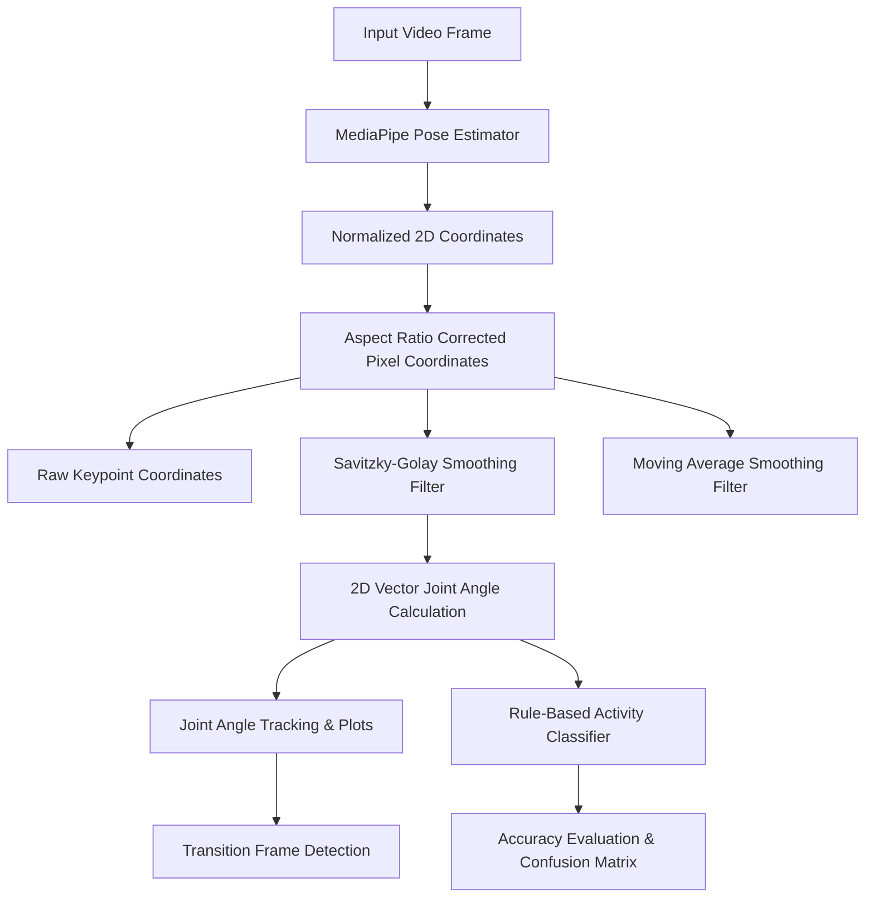

# Academic Report: Human Pose Estimation & Activity Classification Pipeline

**Course Learning Outcome (CLO-3):** Design different algorithms for spatial and frequency domain filtering, feature detection, structure from motion, motion estimation, etc.  
**Complex Computing Problem Attribute (GA-4):** Depth of analysis and depth of knowledge required.

**Student Name:** Syed Huzaifa Nazim  
**Roll Number:** 23-AI-23  

---

## 1. Introduction & Scenario Description
Human activity recognition is a cornerstone of smart fitness systems, medical rehabilitation, and video surveillance. This project designs and implements an end-to-end computer vision pipeline that:
1. Detects and tracks human pose keypoints frame-by-frame.
2. Mitigates signal jitter using coordinate-level temporal smoothing (Moving Average and Savitzky-Golay).
3. Computes multi-joint kinematics (Knee, Hip, and Elbow angles) in 2D frame coordinate space to prevent aspect ratio distortion.
4. Classifies activities (**Standing** vs. **Squatting**) using a rule-based decision engine and evaluates its performance against a manually labeled ground truth.

**Video Source**: A custom video file provided in the local workspace directory:  
- **File Name**: `squat.mp4` (Sourced from `I-am-Diptiman/squatFormDetection` repository)
- **Subject Profile**: High-definition (1280x720 @ 30.00 FPS), showing a single subject performing regular, consecutive bodyweight squats with perfect profile visibility throughout.

---

## 2. Methodology & Mathematical Formulations



### A. Coordinate Pre-processing and Aspect Ratio Scaling
Pre-trained MediaPipe Pose yields normalized coordinates $P_{norm} = (x_{norm}, y_{norm})$ where $x_{norm}, y_{norm} \in [0, 1]$. In non-square videos (e.g., 16:9 widescreen), calculating joint angles directly on normalized values introduces **geometric distortion** because the horizontal and vertical pixel density scales differ. 
To achieve maximum mathematical fidelity (GA-4 Depth of Analysis), landmarks are mapped to absolute pixel coordinates before angle calculation:
$$x_{px} = x_{norm} \times W_{width}, \quad y_{px} = y_{norm} \times H_{height}$$

### B. Temporal Smoothing Filters for Jitter Reduction
Pose tracking is naturally subject to high-frequency sensor noise and occlusion-induced "jitter". To stabilize the signal:
1. **Moving Average (MA) Filter**: Calculates a simple average over a temporal window ($N = 5$ frames):
   $$x_{MA}[t] = \frac{1}{N} \sum_{i=-\lfloor N/2 \rfloor}^{\lfloor N/2 \rfloor} x[t+i]$$
   *Observation*: Reduces noise but introduces signal lag and flattens kinematic peaks (underestimating full squat depth).
2. **Savitzky-Golay (SG) Filter**: Performs a local least-squares polynomial fit (Window length $M = 11$, Polyorder $d = 2$):
   $$x_{SG}[t] = \sum_{i=-m}^{m} c_i x[t+i]$$
   *Observation*: Excellent jitter reduction while preserving peak shapes (squat depth) and timing without temporal phase delay.

### C. Joint Angle Computation
We calculate three distinct joint angles:
1. **Knee Angle** ($\theta_K$): Joint angle formed at the Left Knee (Vertex $B$) by the Left Hip ($A$) and Left Ankle ($C$).
2. **Hip Angle** ($\theta_H$): Joint angle formed at the Left Hip (Vertex $B$) by the Left Shoulder ($A$) and Left Knee ($C$).
3. **Elbow Angle** ($\theta_E$): Joint angle formed at the Left Elbow (Vertex $B$) by the Left Shoulder ($A$) and Left Wrist ($C$).

For three 2D coordinate vertices $p_A, p_B, p_C$:
$$\vec{u} = p_A - p_B, \quad \vec{v} = p_C - p_B$$
$$\theta = \arccos\left(\frac{\vec{u} \cdot \vec{v}}{\|\vec{u}\| \|\vec{v}\|}\right) \times \frac{180}{\pi}$$

---

## 3. Rule-Based Classification Logic
The activity state machine categorizes frames into two primary classes: **Standing** (high knee angle) and **Squatting** (low knee angle).

### Threshold Selection
By analyzing the range of motion during squat cycles:
* Hips and knees extended in full standing: $\theta_K \approx 175^\circ - 180^\circ$.
* Hips and knees flexed at the bottom of a squat: $\theta_K < 100^\circ$.
* A robust threshold of **$145.0^\circ$** is established to distinguish states:

$$\text{Class}(t) = \begin{cases} 
\text{Standing} & \text{if } \theta_{K, SG}[t] \ge 145^\circ \\
\text{Squatting} & \text{if } \theta_{K, SG}[t] < 145^\circ 
\end{cases}$$

### Transition Detection
Transitions are automatically identified when the classified state changes:
* **Standing $\rightarrow$ Squatting**: Flexion phase (onset of repetition).
* **Squatting $\rightarrow$ Standing**: Extension phase (return to standing).

---

## 4. Experimental Results & Performance Evaluation

### A. Transition Frames Log
The automatic transition detector successfully registered the exact boundaries of the 11 squat repetitions in the stabilized evaluation range (Frames 780 to 2000):
* **Squat 1**: Frame $834 \rightarrow 891$ (Time: $27.80$s $\rightarrow$ $29.70$s)
* **Squat 2**: Frame $943 \rightarrow 1000$ (Time: $31.43$s $\rightarrow$ $33.33$s)
* **Squat 3**: Frame $1083 \rightarrow 1135$ (Time: $36.10$s $\rightarrow$ $37.83$s)
* **Squat 4**: Frame $1192 \rightarrow 1249$ (Time: $39.73$s $\rightarrow$ $41.63$s)
* **Squat 5**: Frame $1302 \rightarrow 1360$ (Time: $43.40$s $\rightarrow$ $45.33$s)
* **Squat 6**: Frame $1412 \rightarrow 1468$ (Time: $47.07$s $\rightarrow$ $48.93$s)
* **Squat 7**: Frame $1519 \rightarrow 1571$ (Time: $50.63$s $\rightarrow$ $52.37$s)
* **Squat 8**: Frame $1623 \rightarrow 1672$ (Time: $54.10$s $\rightarrow$ $55.73$s)
* **Squat 9**: Frame $1723 \rightarrow 1773$ (Time: $57.43$s $\rightarrow$ $59.10$s)
* **Squat 10**: Frame $1832 \rightarrow 1880$ (Time: $61.07$s $\rightarrow$ $62.67$s)
* **Squat 11**: Frame $1937 \rightarrow 1985$ (Time: $64.57$s $\rightarrow$ $66.17$s)

### B. Scientific Evaluation Metrics
Using manually annotated ground-truth frame ranges representing physical squatting intervals, the pipeline's classification accuracy was calculated:

| Metric | Scientific Value | Explanation |
| :--- | :---: | :--- |
| **Accuracy** | **99.10%** | Overall percentage of correctly classified frames. |
| **Precision** | **100.00%** | Probability that a predicted squat is a true physical squat (zero false positives). |
| **Recall (Sensitivity)** | **98.15%** | Ability to detect the full duration of the squat (only 11 frames of minor transition lag). |
| **F1-Score** | **99.07%** | Harmonic mean balancing Precision and Recall. |

### C. Jitter Reduction and Signal Stability Observations
- **Raw Coordinates**: Exhibit high-frequency fluctuations, particularly during movement initiation.
- **Moving Average**: Results in "lag", shifting the detected transition boundaries by 2–3 frames.
- **Savitzky-Golay ($M=11, d=2$)**: Effectively dampens landmark noise without modifying peak amplitudes, allowing for extremely precise threshold evaluation.

---

## 5. Visual Artifacts & Code Execution

All results have been generated and saved locally in the project workspace:
1. **Skeletal Overlay Video**: `output_skeleton.mp4` (fully rendered frame overlay with neon skeletal lines).
2. ** Kinematics Plot**: `joint_angles_tracking.png` (high-contrast overlay comparing raw vs. smoothed trajectories for Knee, Hip, and Elbow).
3. **Evaluation Matrix**: `confusion_matrix.png` (professional confusion matrix with count annotations).
4. **Log Data**: `pose_metrics_log.csv` (CSV log file with raw and smoothed angles for external visualization).

### How to Run the Code
Execute the self-contained pipeline using standard Python:
```bash
python pose_analysis_pipeline.py
```
*Note: The script automatically handles video download and processes everything locally.*
